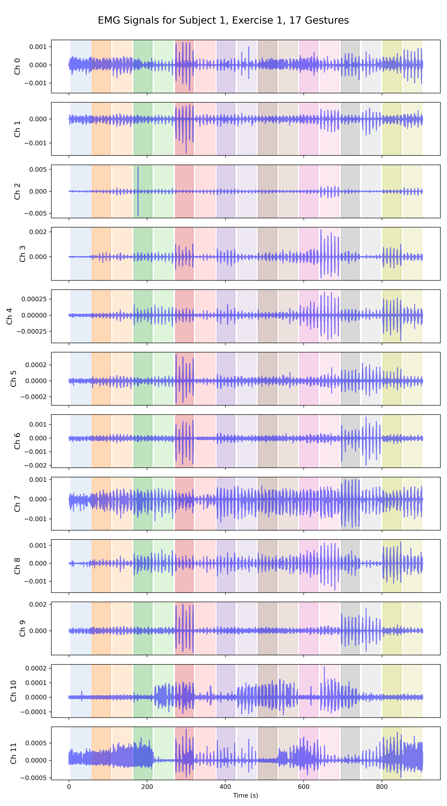
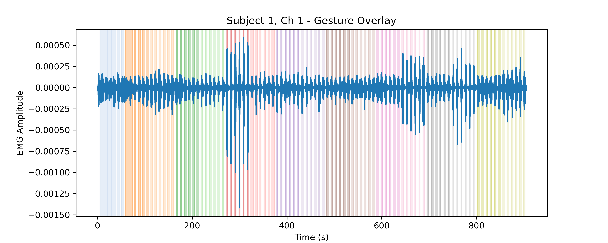

# NinaPro DB2 EMG Gesture Classification

This repository implements an end-to-end ML and deep learning pipeline for decoding **hand and finger gestures from surface EMG (sEMG)** signals using the **NinaPro DB2 dataset**.

The goal of this project is to reproduce and extend classical EMG decoding workflows from preprocessing and feature extraction to deep neural network classifiers and benchmark them on gesture recognition accuracy.

---

## Acquisition setup

1. sEMG data are acquired using 12 Delsys Trigno electrodes
2. kinematic data are acquired using a Cyberglove 2 data glove

## 📂 Dataset — NinaPro DB2

- **Source:** [NinaPro (Non-Invasive Adaptive Prosthetics)](https://ninapro.hevs.ch/instructions/DB2.html)  
- **Subjects:** 40
- **Exercises:** 3
- **Exercise 1:** Basic movements of the fingers
- **Exercise 2:** Grasping and functional movements
- **Exercise 3:** Force patterns
- **Total number of hand movements:** 49 
- **Sensors:** 12-channel Delsys Trigno sEMG  
- **Sampling rate:** 2 kHz  
- **Duration:** ~5 seconds per repetition, followed by 3 second rest
- **Repetitions:** 6 reps per gesture  

## Dataset variables

- **Subject:** subject number
- **Exercise:** exercise number
- **Emg (12 columns):** sEMG signal. Columns 1-8 are the electrodes equally spaced around the forearm at the height of the radio humeral joint. Columns 9 and 10 contain signals from the main activity spot of the muscles flexor and extensor digitorum superficialis, while columns 11 and 12 contain signals from the main activity spot of the muscles biceps brachii and triceps brachii
- **Acc (36 columns):** three-axes accelerometers of the 12 electrodes
- **Glove (22 columns):** uncalibrated signal from the 22 sensors of the cyberglove
The cyberglove signal corresponds to raw data from the cyberglove sensors, which are expected to be proportional to the angles at the joints
- **Stimulus (1 column):** the movement repeated by the subject, according to the displayed movie
- **Restimulus (1 column):** again the movement repeated by the subject, but with the duration of the movement label refined a-posteriori in order to better correspond to the real movement. Read the paper Gijsberts et al., 2014 for more details about relabelling procedure
- **Repetition (1 column):** repetition of the stimulus
- **Rerepetition (1 column):** repetition of restimulus
- **Force (6 columns):** force recorded during the third exercise
- **forcecal (2 x 6 values):** the force sensors calibration values, corresponding to the minimal and the maximal force

---

## Project Overview
In this project, we use multi-channel EMG signals to **classify hand gestures** in the NinaPro DB2 dataset.

We develop two complementary decoding pipelines:

| Pipeline | Approach | Description |
|-----------|-----------|--------------|
| **Classical ML** | Feature-based | RMS, MAV, WL, ZC, SSC + LDA/SVM |
| **Deep Learning** | End-to-end | 1D-CNN / ShallowFBCSPNet / EEGNet-style models |

---

<!-- ---

## Methods

### 1️⃣ Preprocessing
- Band-pass filter (20–450 Hz)
- Notch filter at 50/60 Hz
- Rectification and envelope extraction (low-pass 5–10 Hz)
- Normalization (z-score per channel)
- Epoching into 200–300 ms windows

### 2️⃣ Feature Extraction (Classical)
- **Time-domain:** RMS, MAV, WL, ZC, SSC  
- **Frequency-domain:** Mean and Median Frequency  
- **Time-frequency:** STFT / wavelet features  

### 3️⃣ Machine Learning Models
- Linear Discriminant Analysis (LDA)
- Support Vector Machine (SVM)
- Random Forest

### 4️⃣ Deep Learning Models
- 1D-CNN
- ShallowFBCSPNet (adapted for EMG)
- EEGNet-style compact CNNs

### 5️⃣ Evaluation
- Stratified K-Fold and subject-wise cross-validation  
- Metrics: Accuracy, F1-score, Cohen’s κ  
- Visualization: Confusion matrices and t-SNE embeddings of learned features  
 -->
